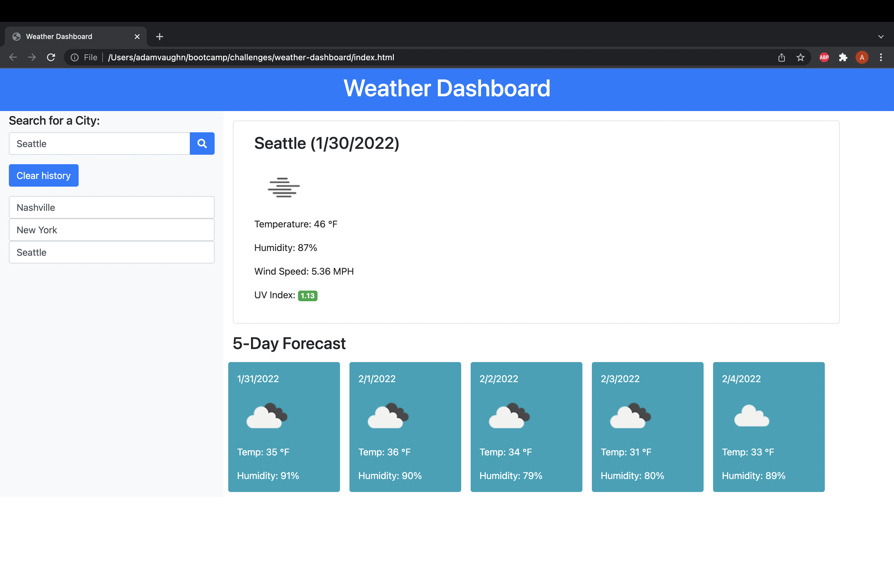

# Weather Dashboard

### Purpose of App
- Allow user to view weather of their chosen city
- Show user current weather conditions
- Color coded UV ratings in order of severity (Green, Yellow, Red)
- Show user five day forecast of location
- Keep log of searched cities for ease of future access
- Allow user to clear log of stored cities

### Screentshot

### Links
- Deployed App: https://adamvaughn.github.io/weather-dashboard/
- GitHub Repo: https://github.com/adamvaughn/weather-dashboard

### Contact Me
- Email: adamdvaughn@gmail.com
- Github: https://github.com/adamvaughn
